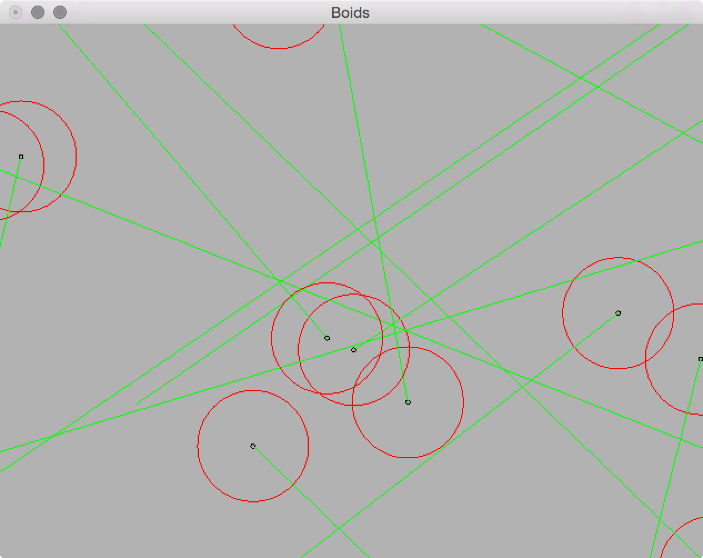

# CS383 Final Project - Willem Yarbrough & Hawk Weisman

## Boids!

Boids is a simple artificial life simulation that mimicks the flocking behaviour of birds.

## Project Proposal

For the final project, we intend to investigate swarming and flocking behavior
in multi-agent systems. Our project will consist of the implementation of a
simulator for multi-agent swarming and flocking with a graphical user interface
to depict the swarms being simulated. The simulator will be modular and
extensible so that additional scenarios and behaviors may be added.

Once we have implemented the simulator, we will experiment with various
behaviors and strategies. Some topics we would like to investigate using our
tool include learning behavior, pattern-forming, and obstacle avoidance.

### Implementation
Our simulator will be implemented in Python, as it represents a common ground of
language proficiency between the two of us. While the details of the
experimentation phase of our project need to be refined, we know that our
simulation must have support for the following:

- **Swarm simulation**: The most fundamental component of our simulation model will
  contain a group of individual swarm agents that are located in some position
  in a coordinate space, which all advance their state over time.
- **Agent support for learning & pattern formation**: A basic, extensible agent
  class will be built that includes critic and learning elements. This learning
  capability will allow the agents to work together to form flocking patterns.
- **Graphics frontend**: A graphics frontend, written using a graphics library such
  as OpenGL or SDL, to render the state of the simulation environment, including
  the swarm objects and any other entities in the environment.

We intend to write our simulation engine using the Model-View-Controller
pattern, which will allow for extensible, loosely-coupled components. This is
desirable because the experimentation phase of our project will likely require
extensions to the learning capabilities of the agent class, or other extensions
such as environmental obstacles.

### Experimentation
The second phase of our project has a number of details that have yet to be
clarified. We plan on using our simulation engine for experimentally evaluating
some swarm-based flocking technique; the nature of this technique will
be decided as our project progresses. Possibilities include:

- **Formation optimization** for obstacle avoidance: Can our swarm learn formations
  that optimizes their ability to avoid obstacles? What do these formations look
  like, and how much tolerance does our flock have for disturbances in its
  formation?
- **Voting-based leader selection**: Most flocks include some kind of leader agent.
  We can explore voting- or auction-based techniques for selection of this leader.

We anticipate that this list of options will be expanded given more familiarity
with the software structure of our agents, and the parameters that are required
for basic flocking capabilies.
